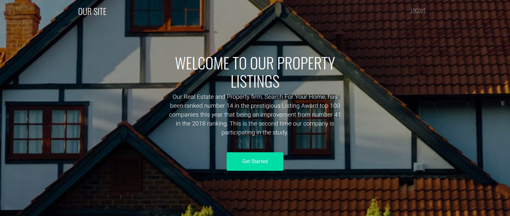

# Search For Your Home
 

#### By:
1. Beryl Negesa ; Scrum Master
1. Brian Nabiswa ; Back end Developer
1. John Kamanja ; Back end Developer
1. Margaret Mwangi ; FRont end Developer
1. Moringa TM's ; Mentors

# DESCRIPTION

Most people have found themselves in a position where they need to move to a new area but do not know anyone in that area. They end up looking for a broker or an online site to help them search for new home.The problem is only 5% of these sites can be trusted.
Search for your home is here to help you search for verified property and contact  owner directly, no brockers.

## User Story

1. As a user I should be able to register and sign in with my credentials.
1. As a user I should be able to log out.
1. As a user I should be able to view house I like on category of choice.
1. As a user I should view details of a particular house of houses to choose from.
1. As a user, I would like to communicate to onwer if I like a property.
1. As a user, I would like to see random houses on the site.

## Known Bugs
If you find a bug (the website couldn't handle the query and / or gave undesired results), kindly open an issue here by including your search query and the expected result.

If you'd like to request a new function, feel free to do so by opening an issue here. Please include sample queries and their corresponding results

## BDD
| Behavior- Our program should handle: | Input Example- When it receives: | Output Example- It should return: |
| :-------------: | :-------------: | :-------------: |
| Allow user to sign up | Click 'sign up'  | Created account |
| Show user all properties listed | Open app | List properties |
| User can click on single property  and view it | Click on the property photo | directs to property details |
| Enable communication with owner | Click 'We are here' | Communicate to owner |
| Enable user to log out | Click 'log out' | taken to home welcome page |

## setup /Installation Requirements
First clone the repo
   ```$ git clone  ```

After cloning, navigate to the project:
   `` $ cd Search-For-Your-Home``

Then install all the requirements through pip:
   ```$ pip install -r requirements.txt ```

Make the file executable:
   ```$ python3.6 manage.py server```
`
Now navigate to your browser at: ```localhost:5000```


## Technologies Used
* Python
* Flask
* HTML5
* CSS3
* Bootstrap
* Javascript

## Support and contact details
In case of any bugs reach out:

:070012345

:0721564545
 
 :berylnegesa@gmail.com

## License

[MIT License](LICENSE.md)
Copyright (c) [2020] [Group Work]
</a>
